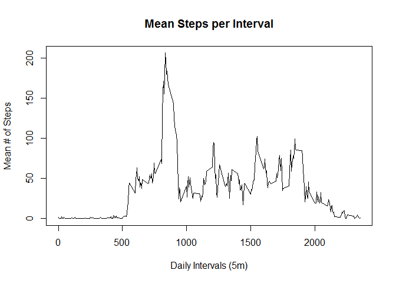
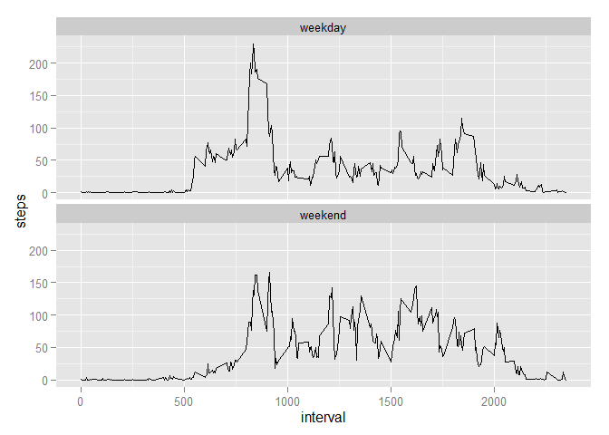

# Reproducible Research: Peer Assessment 1

This is an analysis of the number of steps made by an anonymous individual between October and November 2012. These measurements were made using an activity monitoring devices (e.g. [Fitbit], [Nike Fuelband], or [Jawbone Up] )

[Fitbit]: https://www.fitbit.com/
[Nike Fuelband]: http://www.nike.com/us/en_us/c/nikeplus-fuelband
[Jawbone Up]: https://jawbone.com/up

## Loading and preprocessing the data
We load the activity value directly from the "activity.zip" file (extracing the internal activity.csv file)

```r
activity <- read.csv(unz("activity.zip", "activity.csv"))
```

## What is mean total number of steps taken per day?

```r
stepsPerDay <- aggregate(steps ~ date, data=activity, FUN=sum, na.rm=TRUE)
hist(stepsPerDay$steps, main="Total Steps per Day", xlab="Total # of Steps per Day")
```

 

Calculate the mean steps per day (ignoring NA values)

```r
mean(stepsPerDay$steps)
```

```
## [1] 10766.19
```

Calculate the median number of steps per day (ignoring NA values)

```r
median(stepsPerDay$steps)
```

```
## [1] 10765
```

## What is the average daily activity pattern?
Create a data set that is the mean number of steps per interval and then create the line graph.

```r
meanStepsPerInterval <- aggregate(steps ~ interval, data=activity, FUN=mean)
plot(meanStepsPerInterval$interval, meanStepsPerInterval$steps, type ="l", main="Mean Steps per Interval", ylab="Mean # of Steps", xlab="Daily Intervals (5m)")
```

 

## Imputing missing values
Calculate the number of missing values in the data set

```r
sum(is.na(activity$steps))
```

```
## [1] 2304
```
Use the calculated mean steps per interval to impute the number of steps per interval for intervals missing data.

```r
activityDelta <- activity 
activityDelta[is.na(activityDelta$steps),]$steps = sapply(activityDelta[is.na(activityDelta$steps),]$interval, function(x) meanStepsPerInterval[meanStepsPerInterval$interval ==x,]$steps)
stepsPerDay <- aggregate(steps ~ date, data=activityDelta, FUN=sum, na.rm=TRUE)
hist(stepsPerDay$steps, main="Total Steps per Day", xlab="Total # of Steps per Day")
```

 
Calculate the mean steps per day (ignoring NA values)

```r
mean(stepsPerDay$steps)
```

```
## [1] 10766.19
```

Calculate the median number of steps per day (ignoring NA values)

```r
median(stepsPerDay$steps)
```

```
## [1] 10766.19
```

By imputing missing values using interval means we increase the number of days where the "mean" number of steps is taken, and have vey little impact on the mean and median (they become equal and were increased by about 1)

## Are there differences in activity patterns between weekdays and weekends?

```r
library(ggplot2)
activityDelta$dayType = sapply(weekdays(as.Date(activityDelta$date, "%Y-%m-%d")), function(x) ifelse(x == "Sunday" || x == "Saturday", "weekend", "weekday"))
activityByDayType <- aggregate(steps ~ interval + dayType, data=activityDelta, mean)
ggplot(activityByDayType, aes(interval, steps))+geom_line()+facet_wrap(~dayType, ncol=1)
```

 
